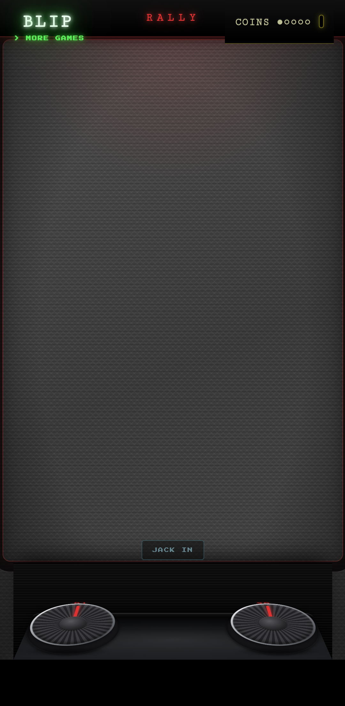

# Android multiplayer test report

**Command:** `npm run test:multiplayer:android`  
**Result:** 7/7 passing on two Android 34 emulators.

Flow: host creates an offer, guest injects/scans it and creates an answer,
host injects/scans the answer, both DataChannels open, the host launches the
match, and guest input synchronizes the host and guest paddles.

| Checkpoint | Evidence |
|---|---|
| Paired host and guest |   |
| Synchronized gameplay |   |

Screenshots are regenerated by the Android test. The test uses injected QR
payloads, but real Chrome-for-Android ICE, DataChannel, WASM gameplay, and
input synchronization.
